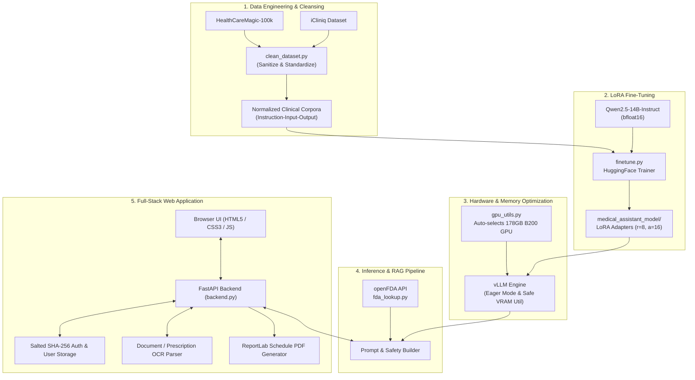
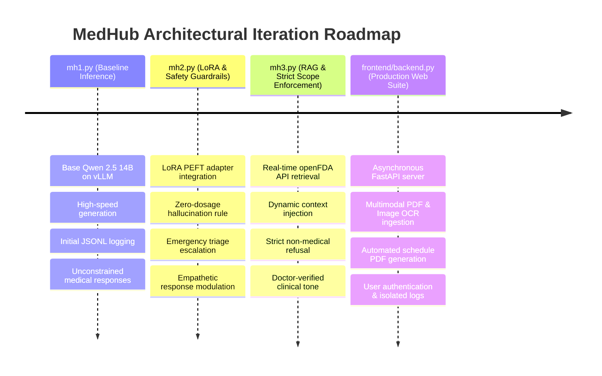
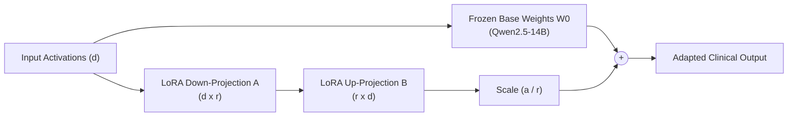
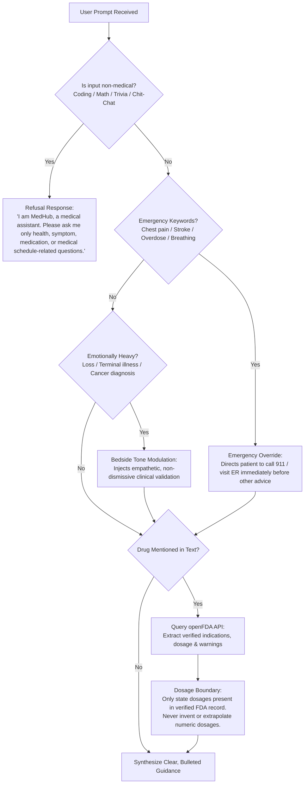

# 🩺 MedHub AI — Autonomous Clinical & Medical Assistant

<div align="center">

[](#)
[](#)
[](#)
[](#)
[](#)
[](#)
[-76B900.svg?logo=nvidia&logoColor=white)](#)
[](#)

**A privacy-preserving, domain-specialized AI Medical Assistant powered by fine-tuned Qwen 2.5 (14B), real-time openFDA retrieval-augmented generation (RAG), clinical safety guardrails, multimodal medical document OCR ingestion, and dynamic prescription schedule PDF synthesis.**

[Key Capabilities](#-key-capabilities) • [Architecture](#-system-architecture) • [Evolution Stages](#-iterative-evolution-mh1--mh3) • [Dataset & Fine-Tuning](#-dataset-curation--lora-fine-tuning) • [Safety Guardrails](#-clinical-safety-guardrails--triage) • [Web App & Features](#-full-stack-web-application) • [Quickstart](#-quickstart--deployment)

</div>

---

## 🌟 Overview

**MedHub** is an end-to-end medical conversational assistant developed to bridge the gap between complex clinical literature and patient-friendly consultations. Fine-tuned on over **100,000+ verified doctor-patient clinical dialogues** using Parameter-Efficient Fine-Tuning (LoRA), MedHub pairs conversational empathy with strict real-time grounding in **openFDA** drug databases to eliminate dosage hallucinations and enforce rapid emergency triage.

```
       +-----------------------------------------------------------+
       |                  MedHub Interaction Flow                  |
       +-----------------------------------------------------------+
                                     |
               +---------------------+---------------------+
               |                                           |
        [ Patient Query ]                          [ Medical Document ]
               |                                   (PDF / Prescription)
               |                                           |
               |                                  [ OCR / PDF Parser ]
               |                                           |
               +---------------------+---------------------+
                                     |
                         [ Safety & Triage Router ]
                                     |
               +---------------------+---------------------+
               |                     |                     |
        [ Emergency ]         [ Non-Medical ]       [ Medical Query ]
        Immediate 911 /       Strict Refusal &             |
        ER Redirection        Scope Enforcement     [ openFDA RAG ]
                                                    (Drug Facts & Dosage)
                                                           |
                                                [ Fine-Tuned Qwen 14B ]
                                                (LoRA Adapter via vLLM)
                                                           |
                                              [ Formatted Response & ]
                                              [ Dynamic Schedule PDF ]
```

---

## 🚀 Key Capabilities

| Feature | Description | Technical Stack |
| :--- | :--- | :--- |
| **Domain-Adapted LLM** | Fine-tuned 14-billion parameter clinical model trained on doctor-patient interactions | `Qwen/Qwen2.5-14B-Instruct` + `LoRA` |
| **High-Throughput Serving** | Sub-second latency token streaming and eager-mode inference | `vLLM` Engine + BF16 precision |
| **Verified Drug RAG** | Live drug lookup for indications, dosage verification, and interaction warnings | `openFDA API` label endpoints |
| **Zero-Hallucination Dosages** | Absolute ban on model-invented drug dosages; relies solely on FDA label facts | Regex token filtering + Prompt boundaries |
| **Emergency Triage** | Instant escalation for life-threatening symptoms (cardiac, stroke, overdose, etc.) | Heuristic keyword classifier & system prompts |
| **Compassionate Bedside Tone** | Emotional tone recognition for terminal conditions, grief, and chronic diagnoses | Dynamic sentiment injection |
| **Document & Prescription OCR** | Ingestion of lab reports, imaging notes, and prescription scans | `pypdf` + OCR API pipeline |
| **Interactive Medication Schedules** | Automatic conversion of medication routines into downloadable PDF documents | `ReportLab` tabular layout engine |
| **Private Multi-User Storage** | Multi-account authentication with salted SHA-256 hashing and user-isolated logs | FastAPI + JSON/JSONL persistence |

---

## 🏗 System Architecture

The MedHub stack spans data preprocessing, distributed parameter-efficient fine-tuning, dynamic GPU memory management, high-throughput inference serving, and a responsive web application.



---

## 🔬 Iterative Evolution: `mh1` ➔ `mh3`

MedHub was systematically engineered across three developmental iterations, each addressing critical clinical alignment, safety bounds, and verification needs:



### Detailed Evolution Comparison

| Capability | Iteration 1 (`mh1.py`) | Iteration 2 (`mh2.py`) | Iteration 3 (`mh3.py`) | Production (`backend.py`) |
| :--- | :---: | :---: | :---: | :---: |
| **Model Weights** | Base Model | Fine-Tuned LoRA | Fine-Tuned LoRA | Fine-Tuned LoRA |
| **Serving Framework** | vLLM CLI | vLLM CLI | vLLM CLI | vLLM + FastAPI REST |
| **Dosage Safety Rule** | ❌ Unconstrained | ⚠️ Generic Warning | 🛡️ Verified FDA Only | 🛡️ Verified FDA Only |
| **Emergency Detection** | ❌ None | ✅ Keyword Alert | ✅ Immediate Escalation | ✅ Immediate Escalation |
| **Bedside Tone Adaptation** | ❌ None | ✅ Empathy Injection | ✅ Empathy Injection | ✅ Empathy Injection |
| **External Clinical RAG** | ❌ None | ❌ None | 🌐 openFDA REST API | 🌐 openFDA REST API |
| **Off-Topic Scope Filter** | ❌ Open Domain | ⚠️ Partial | 🛑 Strict Refusal | 🛑 Multi-Layer Refusal |
| **Document/Image OCR** | ❌ None | ❌ None | ❌ None | 📄 PDF + Image Parser |
| **Prescription Schedule PDF** | ❌ None | ❌ None | ❌ None | 📥 ReportLab Exporter |
| **Multi-User Isolation** | ❌ Shared log | ❌ Shared log | ❌ Shared log | 🔐 Salted Auth & Storage |

---

## 📊 Dataset Curation & LoRA Fine-Tuning

### 1. Data Cleaning & Normalization (`clean_dataset.py`)
MedHub merges two clinical QA datasets:
- **HealthCareMagic-100k**: Rich multi-turn patient-doctor consultations.
- **iCliniq**: Verified patient questions paired with clinical responses.

The dataset cleaning pipeline:
1. Replaced legacy identifiers and bot names (`Chat Doctor`, `ChatDoctor`) with `MedHub`.
2. Normalized divergent schema keys (`answer_icliniq`, `answer_chatgpt`, `output`) into a unified clinical structure:
   ```json
   {
     "instruction": "If you are a doctor, please answer the medical questions based on the patient's description.",
     "input": "<Patient Symptoms & History>",
     "output": "<Clinically Sound Medical Guidance>"
   }
   ```
3. Formatted entries into instruction-tuning tokens with explicit demarcation headers:
   ```
   ### Instruction:
   If you are a doctor, please answer the medical questions based on the patient's description.

   ### Patient:
   <User Query>

   ### Doctor:
   <MedHub Clinical Guidance>
   ```

### 2. PEFT / LoRA Training Regimen (`finetune.py`)
To retain the reasoning abilities of **Qwen2.5-14B-Instruct** while specializing in clinical diagnosis and communication, we trained Low-Rank Adaptation (LoRA) matrices on the attention projections.



<details>
<summary><b>Click to inspect Fine-Tuning Hyperparameters</b></summary>

```python
# Model & Tokenizer
MODEL_NAME = "Qwen/Qwen2.5-14B-Instruct"
dtype = torch.bfloat16

# LoRA Configuration
lora_config = LoraConfig(
    r=8,                       # Rank dimension
    lora_alpha=16,             # Scaling factor
    lora_dropout=0.05,         # Regularization
    target_modules=["q_proj", "v_proj"], # Query and value projection attention layers
    task_type="CAUSAL_LM"
)

# Training Hyperparameters
training_args = TrainingArguments(
    output_dir="./medical_assistant_checkpoints",
    per_device_train_batch_size=2,
    gradient_accumulation_steps=4,      # Effective batch size: 8
    num_train_epochs=3,
    learning_rate=2e-4,
    logging_steps=10,
    save_strategy="steps",
    save_steps=2000,
    bf16=True,
    report_to="none"
)
```
</details>

---

## ⚡ GPU Architecture & Auto-Allocation (`gpu_utils.py`)

Deploying a 14B parameter model alongside dynamic LoRA adapters requires strict memory isolation, especially in environments with mixed MIG (Multi-Instance GPU) instances and large accelerators.

MedHub's custom `gpu_utils.py` handles:
1. **Physical Bus Detection**: Enforces `CUDA_DEVICE_ORDER="PCI_BUS_ID"` to prevent device index shifting.
2. **Automated B200 Selection**:
   - Queries `nvidia-smi` hardware stats via low-level subprocess calls before PyTorch initializes the CUDA runtime.
   - Automatically detects full-sized **178GB NVIDIA B200 GPUs** (indices `1`, `2`, `3`).
   - Automatically bypasses GPU `0` (often contested) and small 20GB MIG partitions (indices `4-7`).
3. **Dynamic vLLM Memory Sizing**:
   - Accurately computes available free VRAM.
   - Reserves a strict safety margin (4GB) to guarantee that PyTorch's KV-cache never exceeds physical limits.
   - Sets `PYTORCH_CUDA_ALLOC_CONF="expandable_segments:True"`.

```
+--------------------------------------------------------------------------+
| NVIDIA B200 (178GB Total VRAM)                                           |
| [ Base Qwen 2.5 14B (~28GB) ] + [ LoRA Adapter (~1GB) ]                 |
| [ Dynamic KV Cache (~4-6GB) ] + [ 4GB Safety Margin ]                    |
| Remaining Free VRAM: >130GB (Zero OOM / High Concurrency)                |
+--------------------------------------------------------------------------+
```

---

## 🛡️ Clinical Safety Guardrails & Triage

MedHub implements a defense-in-depth safety architecture to address key risks in healthcare language models:



### 1. Dosage Safety Protocol
- **Zero-Dosage Hallucination Rule**: MedHub is prohibited from guessing or calculating numeric milligram amounts.
- If verified FDA data matches the specific patient context (e.g. age bracket, condition), MedHub summarizes the official guidance.
- If no verified FDA record covers the specific case, MedHub prompts the patient to consult a licensed physician or pharmacist.

### 2. Emergency Triage Detection
- Real-time screening for acute presentations: myocardial infarction (`radiating chest tightness`), stroke symptoms (`slurred speech`, `sudden weakness`), severe respiratory distress, acute toxic ingestions, and psychiatric crises.
- Bypasses standard chit-chat and places urgent emergency warnings at the top of the response.

### 3. Strict Scope Enforcement
- Automatically deflects inquiries unrelated to health, medicine, pathology, nutrition, pharmacology, or clinical schedules.
- Prevents jailbreaks or model misuse across coding, politics, finance, and general homework tasks.

---

## 🌐 Full-Stack Web Application

The repository includes a modern, asynchronous clinical interface served by FastAPI.

```
frontend/
├── backend.py            # FastAPI server, vLLM engine, openFDA RAG, ReportLab PDF builder
├── akonaditray.svg       # Medical cross & heart logo emblem
└── static/
    ├── index.html        # Semantic, accessible chat application interface
    ├── style.css         # Modern medical UI styling, responsive typography & modals
    ├── script.js         # Client state, file uploads, table rendering & PDF triggers
    └── akonaditray.svg   # Vector asset for browser favicons and headers
```

### 1. Interactive UI Features
- **Clean Aesthetic**: Custom typography, refined contrast ratios, subtle medical blues, and animated state indicators.
- **Multimodal Uploads**: In-chat preview for diagnostic lab reports, clinical scans, and prescriptions (both PDF documents and image files).
- **Interactive Markdown Tables**: Ingests clinical plans and schedules, rendering them into clean HTML tables.
- **Dynamic PDF Prescription Export**: Automatically attaches a **"Download PDF"** button next to rendered schedules, producing formatted patient handouts on demand.
- **New Chat Context Management**: Easily clears conversational state for a new patient encounter while preserving user credentials.

### 2. User Authentication & Data Privacy
- **Account Creation & Login**: In-browser modal for instant user switching and registration.
- **Salted Password Hashing**: Passwords stored using `hashlib.sha256` with per-user randomized salt tokens.
- **Isolated User Storage**:
  - Each patient's history is isolated to its own sandbox (`user_data/<username>/<username>.jsonl`).
  - Self-healing architecture: if a directory or log file is removed, MedHub recreates it dynamically without throwing 500 errors.

---

## 📁 Repository Structure

```plaintext
.
├── clean_dataset.py                    # Data sanitation pipeline (replaces legacy bot names, normalizes schemas)
├── finetune.py                         # LoRA fine-tuning script for Qwen2.5-14B on medical datasets
├── fda_lookup.py                       # openFDA REST API client with intelligent candidate word extraction
├── gpu_utils.py                        # Hardware allocator for NVIDIA B200 GPUs & dynamic vLLM sizing
├── mh1.py                              # Stage 1: Base Qwen2.5-14B vLLM text generation prototype
├── mh2.py                              # Stage 2: LoRA adapter + emergency triage + empathy guardrails
├── mh3.py                              # Stage 3: openFDA RAG integration + strict medical scope enforcement
├── frontend/
│   ├── backend.py                      # Production FastAPI server, vLLM serving, auth, OCR & PDF synthesis
│   ├── akonaditray.svg                 # MedHub logo icon
│   └── static/
│       ├── index.html                  # Responsive web interface with auth modal & upload triggers
│       ├── style.css                   # Custom styles, responsive grid, tables, and animations
│       └── script.js                   # Client logic: auto-expanding input, OCR upload, table-to-PDF triggers
├── user_data/                          # Encrypted credentials & user-isolated conversation logs
└── README.md                           # Comprehensive documentation & architecture guide
```

---

## 💻 Quickstart & Deployment

### Prerequisites
- Linux OS (Ubuntu 22.04 LTS or newer recommended)
- Python 3.10+
- NVIDIA GPU with CUDA 12.1+ (Minimum 32GB VRAM for 14B LoRA inference; NVIDIA A100 / H100 / B200 recommended)

### 1. Environment Setup
```bash
# Clone the repository
git clone https://github.com/5avis/LLM-01.git
cd LLM-01

# Create and activate virtual environment
python3 -m venv venv
source venv/bin/activate

# Install dependencies
pip install torch transformers peft datasets vllm fastapi uvicorn pypdf reportlab requests
```

### 2. Prepare Datasets & Run Fine-Tuning
```bash
# 1. Clean raw clinical datasets
python3 clean_dataset.py

# 2. Launch LoRA fine-tuning (exports weights to ./medical_assistant_model)
python3 finetune.py
```

### 3. Launch Interactive Command-Line Testing
Test the evolutionary milestones directly from the terminal:
```bash
# Run Iteration 1 (Base Model CLI)
python3 mh1.py

# Run Iteration 2 (LoRA + Safety Guardrails CLI)
python3 mh2.py

# Run Iteration 3 (LoRA + openFDA RAG + Strict Scope CLI)
python3 mh3.py
```

### 4. Launch Production Web Server
```bash
# Start the FastAPI web server on port 7860
python3 frontend/backend.py
```
Open your browser and navigate to:
```
http://localhost:7860
```

---

## 🔌 API Reference

### 1. `POST /api/chat`
Processes conversational queries with full guardrail evaluation and openFDA RAG grounding.

<details>
<summary><b>Request & Response Example</b></summary>

**Request Body (`application/json`):**
```json
{
  "message": "What is the recommended dosage for Ibuprofen for adults?",
  "username": "siva",
  "is_first_message": false
}
```

**Response Body:**
```json
{
  "response": "According to verified FDA labeling for Ibuprofen:\n- Adults may take 200 mg to 400 mg every 4 to 6 hours as needed for pain or fever.\n- Do not exceed 1200 mg in 24 hours unless directed by a doctor.\n- Always take with food or milk if stomach upset occurs. Consult a healthcare provider if symptoms persist beyond 10 days."
}
```
</details>

### 2. `POST /api/chat-with-file`
Accepts multipart form data including patient questions and uploaded medical records (PDF or images).

<details>
<summary><b>Request & Response Example</b></summary>

**Parameters (`multipart/form-data`):**
- `message`: User question or symptom summary
- `username`: Active user handle
- `file`: Attached file binary (`.pdf`, `.png`, `.jpg`)
- `is_first_message`: Boolean string (`"true"` / `"false"`)

**Response:**
Returns clinical assessment of both the uploaded diagnostic text and patient symptoms.
</details>

### 3. `POST /api/generate-schedule-pdf`
Generates a downloadable, professionally formatted PDF document from clinical schedule markdown tables.

---

## ⚕️ Ethical Considerations & Medical Disclaimer

> [!CAUTION]
> **Important Medical Disclaimer**
> 
> MedHub is an artificial intelligence research system designed to assist patients in organizing health inquiries, understanding clinical terminology, and exploring verified FDA documentation. 
> 
> - **Not a Replacement for Professional Medical Judgment**: MedHub cannot diagnose conditions, prescribe medications, or formulate definitive treatment plans.
> - **Emergencies**: If you or someone around you is experiencing severe symptoms, immediate chest pain, acute difficulty breathing, signs of stroke, or trauma, contact emergency medical services (such as 911) or visit the nearest emergency department immediately.
> - **Prescriptions & Dosing**: Always verify medication dosages, contraindications, and schedules with a board-certified physician or licensed pharmacist.

---

## 📄 License
This project is licensed under the MIT License — see the [LICENSE](LICENSE) file for details.
